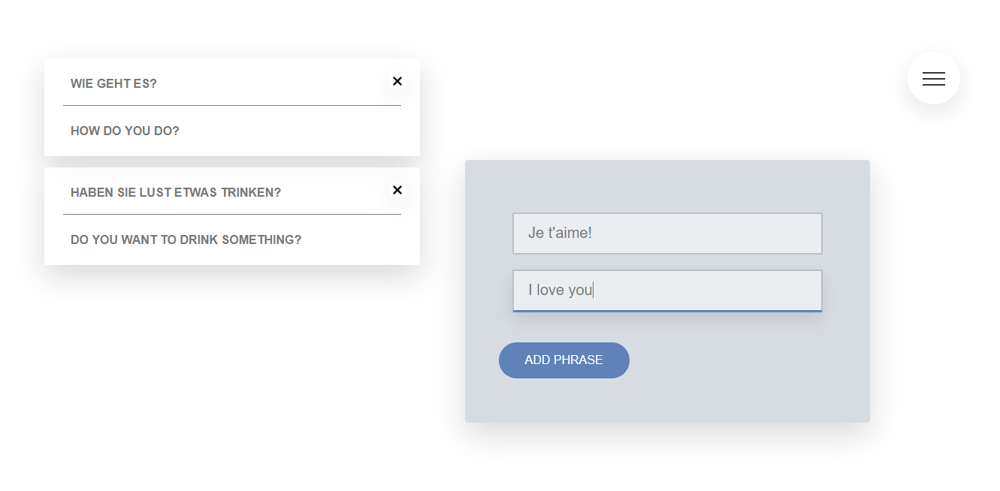
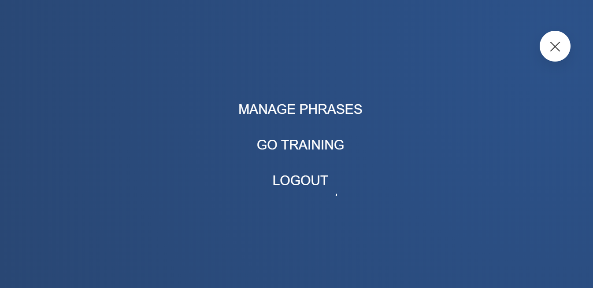
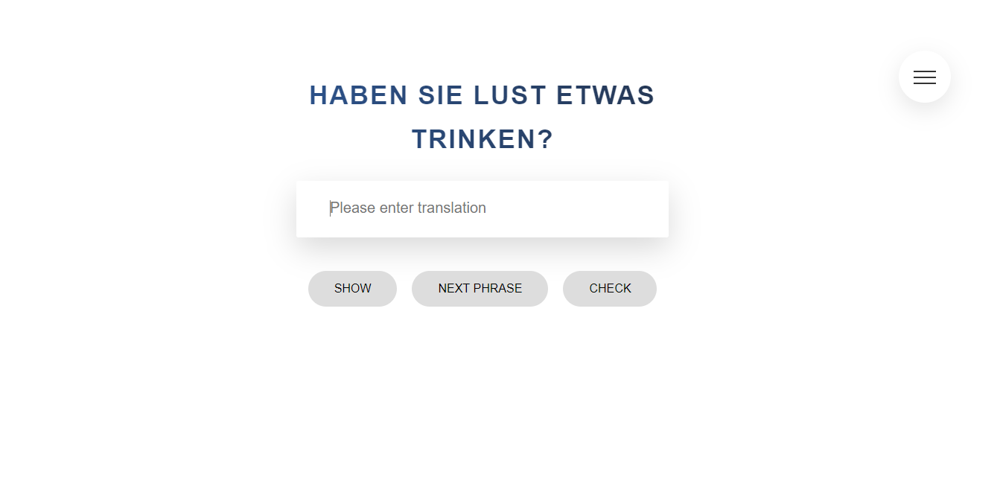
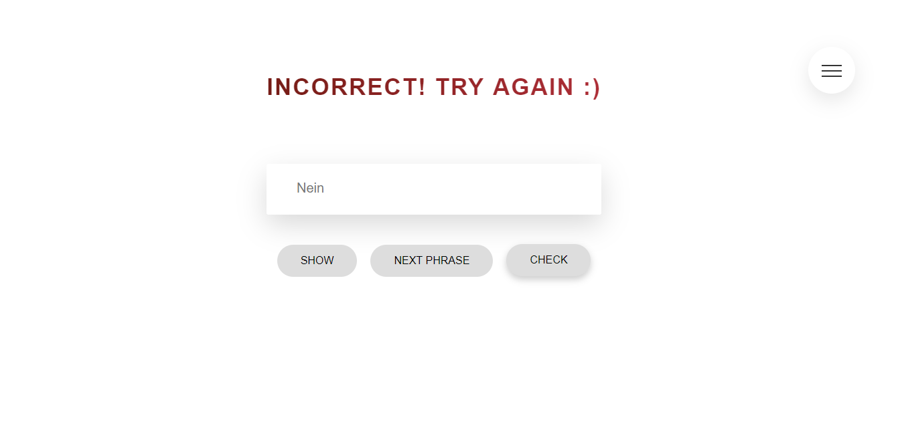

# language-app
This is an app, which lets you add words or phrases in language you are learning as well as translation for these words/phrases.
Once phrases are added you can go to training mode and check your knowledge by entering translation for your words/phrases which appear
in random order on the screen.

# screenshots

